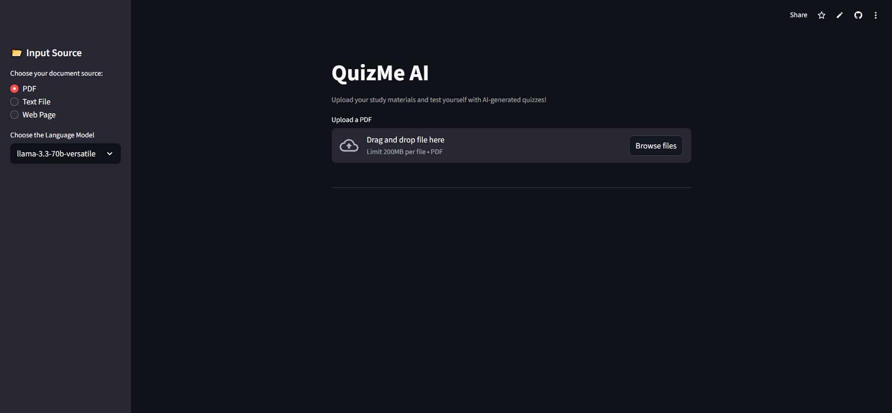
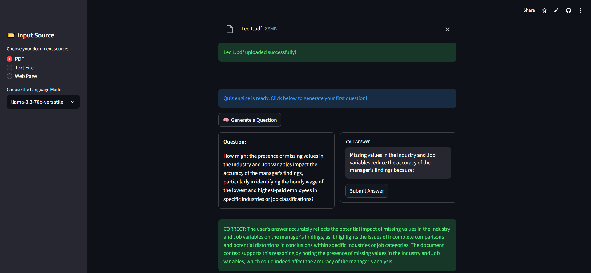

# QuizMe AI: AI-Powered Quiz Generator

[](https://gamjgnfzqtpnvygec8wflz.streamlit.app/)

**QuizMe AI** is an intelligent learning application that transforms your study materials into interactive quizzes. Instead of passively reading documents, you can upload a PDF, text file, or provide a webpage URL, and let our AI tutor challenge you with insightful questions to ensure you truly master the content.

This project inverts the typical "chat-with-your-pdf" model. Here, the AI takes the lead, acting as a personal tutor to generate questions and validate your answers directly against the source material.

## 🚀 Live Demo

**Experience DocuTutor live:** [](https://gamjgnfzqtpnvygec8wflz.streamlit.app/)

## 📸 Screenshots





## ✨ Features

-   **Multi-Source Input:** Upload PDFs, TXT files, or simply paste a URL from a webpage.
-   **Intelligent Content Extraction:** Utilizes advanced loaders (`UnstructuredPDFLoader`, `PyPDFLoader`, `WebBaseLoader`) to accurately extract the main content from complex documents and websites, ignoring irrelevant clutter.
-   **AI-Powered Question Generation:** Leverages the high-speed Groq API with Llama3 to generate relevant, open-ended questions based on the document's content.
-   **Interactive Q&A Loop:** A clean, intuitive interface for receiving questions and submitting answers.
-   **Smart Answer Validation:** Employs a Retrieval-Augmented Generation (RAG) pipeline to validate your answers. It finds the most relevant passages from the source document to check for correctness, providing instant feedback and explanations.

## ⚙️ How It Works: The RAG Architecture

This application is built on a sophisticated Retrieval-Augmented Generation (RAG) pipeline to ensure accuracy and relevance.

1.  **📄 Document Ingestion & Processing:**
    -   The user uploads a document or provides a URL.
    -   The appropriate LangChain loader (`UnstructuredPDFLoader` for complex PDFs, `WebBaseLoader` for URLs) parses and extracts clean, structured text.

2.  **🧩 Chunking & Embedding:**
    -   The extracted text is split into smaller, manageable chunks using `RecursiveCharacterTextSplitter`.
    -   Each chunk is then converted into a numerical vector (an embedding) using a sentence-transformer model from the Hugging Face Inference API. These vectors represent the semantic meaning of the text.

3.  **🧠 Indexing in a Vector Store:**
    -   All text chunks and their corresponding embeddings are stored and indexed in a FAISS vector database. This creates a powerful, searchable knowledge base from the document.

4.  **❓ Question Generation Loop:**
    -   A random chunk is selected from the document.
    -   A carefully crafted prompt instructs the Groq LLM to act as a tutor and generate one insightful question based *only* on the context of that chunk.

5.  **✅ Answer Validation Loop:**
    -   The user submits their answer.
    -   The original question is used to perform a similarity search in the FAISS vector store, retrieving the most relevant chunks from the document.
    -   A second, highly specific prompt is sent to the Groq LLM. This prompt includes the original question, the user's answer, and the retrieved context.
    -   The LLM is instructed to act as an examiner, determining if the user's answer is correct based *only* on the provided source text, and to explain its reasoning.


## 🛠️ Tech Stack

-   **Frontend:** [Streamlit](https://streamlit.io/)
-   **LLM Inference:** [Groq API](https://groq.com/) (using Llama3 models)
-   **Core AI Logic:** [LangChain](https://www.langchain.com/)
-   **Embeddings:** [Hugging Face Inference API](https://huggingface.co/inference-api) (`sentence-transformers/all-MiniLM-L6-v2`)
-   **Vector Store:** [FAISS](https://github.com/facebookresearch/faiss)
-   **Document Parsing:** [Unstructured.io](https://unstructured.io/)
-   **Deployment:** [Streamlit Community Cloud](https://streamlit.io/cloud)


## 📦 Getting Started Locally

To run this project on your own machine, follow these steps.

### Prerequisites

-   Python 3.9+
-   An API key from [Groq](https://console.groq.com/keys)
-   An API token from [Hugging Face](https://huggingface.co/settings/tokens)

### Installation

1.  **Clone the repository:**
    ```bash
    git clone https://github.com/Adam556678/quiz-me-ai.git
    cd quiz-me-ai
    ```

2.  **Create a virtual environment and activate it:**
    ```bash
    # For Windows
    python -m venv venv
    venv\Scripts\activate

    # For macOS/Linux
    python3 -m venv venv
    source venv/bin/activate
    ```

3.  **Install the required dependencies:**
    ```bash
    pip install -r requirements.txt
    ```

### Configuration

1.  Create a file named `.env` in the root of the project directory.
2.  Add your API keys to this file:
    ```
    GROQ_API_KEY="gsk_YOUR_GROQ_API_KEY"
    HUGGINGFACEHUB_API_TOKEN="hf_YOUR_HUGGINGFACE_API_TOKEN"
    ```

### Running the App

Launch the Streamlit application with the following command:
```bash
streamlit run app.py
